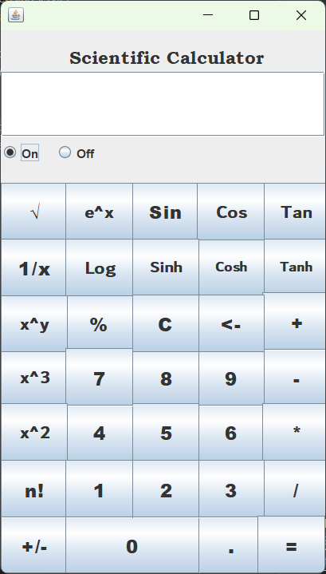
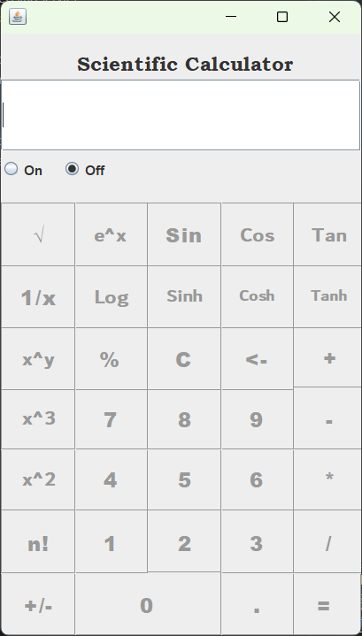
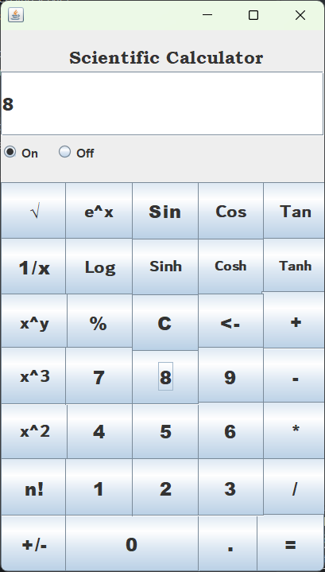
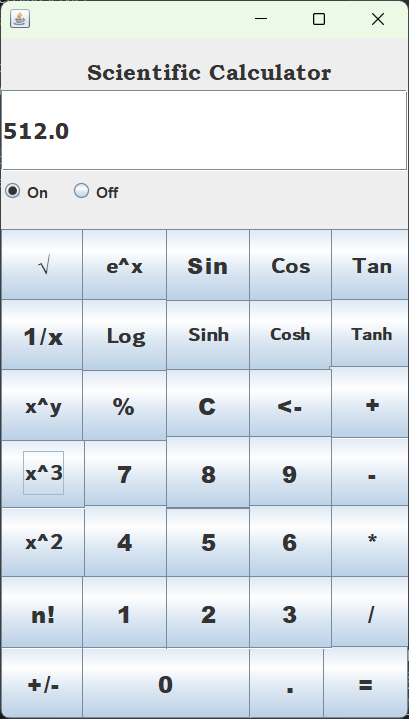

# Java Scientific Calculator GUI Project

## Overview
This Java project is a feature-rich scientific calculator with a Graphical User Interface (GUI). It offers an intuitive interface for performing complex mathematical calculations conveniently.

## Features
- **Standard and Scientific Functions:** Includes basic arithmetic operations along with a wide range of scientific functions such as trigonometric, logarithmic, and exponential functions.
- **Memory Functionality:** Store and recall values using memory buttons.

## Screenshots

## Getting Started
1. **Prerequisites:** Ensure you have Java installed on your system.
2. **Clone the Repository:** `git clone https://github.com/priyam1608/java-scientific-calculator.git`
3. **Build and Run:** Open the project in your favorite Java IDE and run the `Calculator.java` file.

## Usage
- **Basic Operations:** Perform addition, subtraction, multiplication, and division using the standard buttons.
- **Scientific Functions:** Access trigonometric, logarithmic, and exponential functions from the scientific panel.

## Contributing
Contributions are welcome! If you have any ideas for improvement or find any bugs, feel free to open an issue or submit a pull request.

## License
This project is licensed under the [MIT License](LICENSE).

## Acknowledgments
- Special thanks to some youtube channels like codewithharry, telusko, codingWallah ,etc for the inspiration and guidance.
